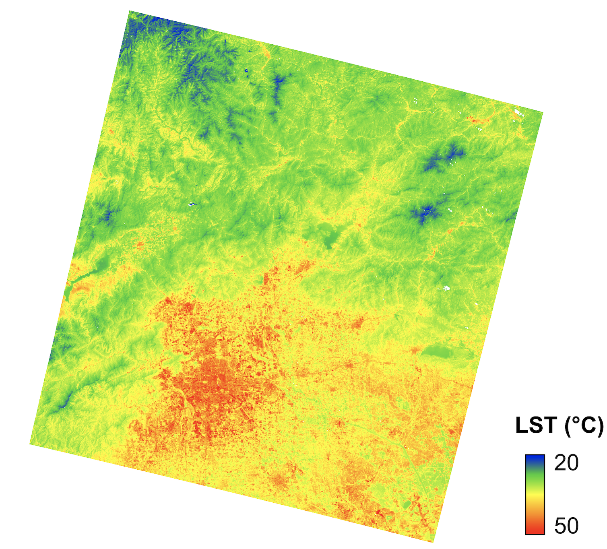

# research_data
This repository shares the data in my researches published.

## Land surface temperature
- Land surface temperature on July 10, 2017, Beijing, China, retrieved from the Landsat 8 image with a spatial resolution of 30 m. 
  - Available at: https://drive.google.com/drive/folders/1l0GieK7ENPxOY6Ap2NTB6XO2XJ2ZmUAP?usp=sharing 
  - Data citation: Zhao, J., Zhao, X., Liang, S., Zhou, T., Du, X., Xu, P. and Wu, D., 2020. Assessing the thermal contributions of urban land cover types. ***Landscape and Urban Planning***, 204, p.103927. 

## Surface parameters of urban green spaces (UGSs) in Beijing main city from 1984 to 2020
- Land surface temperature on July 10, 2017, Beijing, China, retrieved from the Landsat 8 image with a spatial resolution of 30 m. 
  - Available at: https://drive.google.com/drive/folders/1l0GieK7ENPxOY6Ap2NTB6XO2XJ2ZmUAP?usp=sharing 
  - Data citation: Zhao, J., Zhao, X., Liang, S., Zhou, T., Du, X., Xu, P. and Wu, D., 2021. Dynamic Cooling Effects of Permanent Urban Green Spaces in Beijing, China. ***Remote Sensing***, 204, p.103927. 
